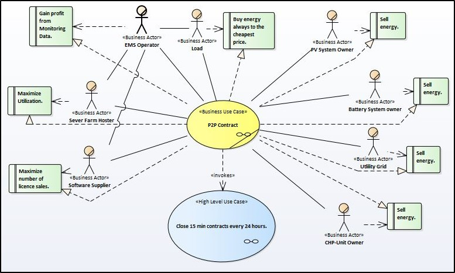
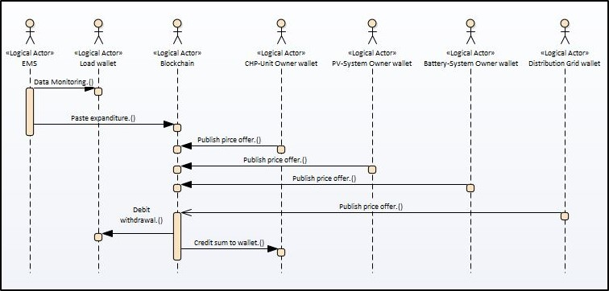
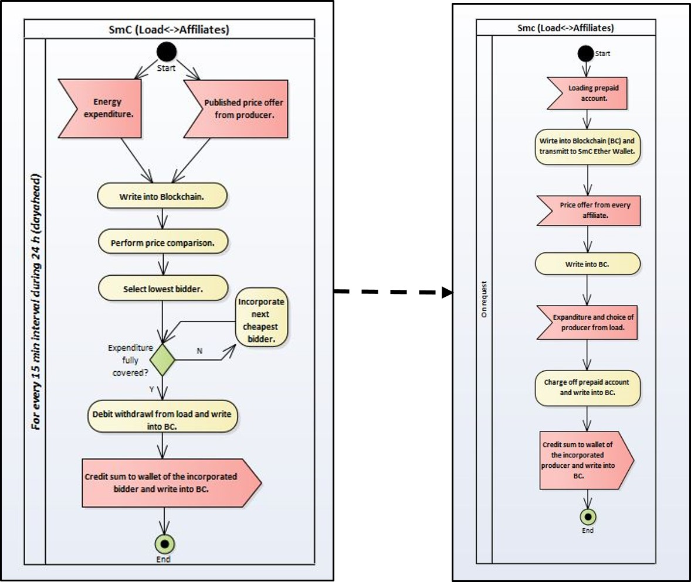
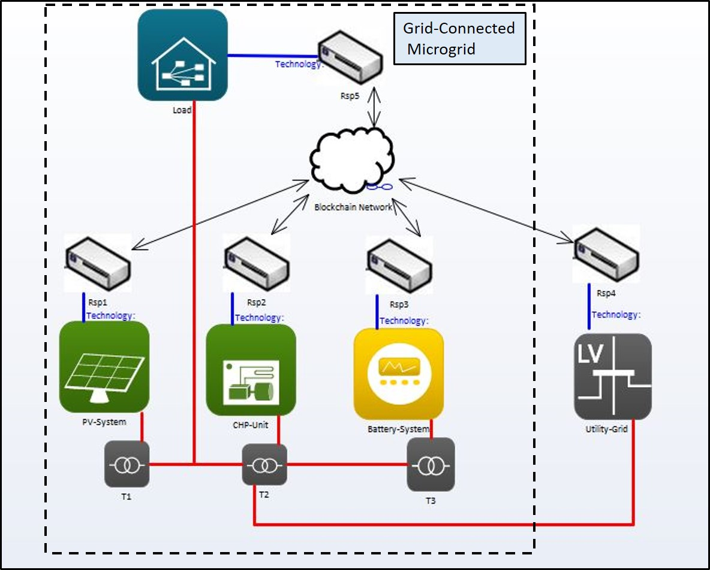

# 4. Development of the Business Model

### Modelling of the Business Model in SGAM

To accomplish the depiction, the trial version of the modeling programm "Enterprise Architect" developed by SparxSystems was used. The modeling follwod the guidline "Arbeitsgrundlagen Marktkommunikation" Vers. 1.1 published by the BDEW \(Federal Assosiation of the Energy and Watereconomy\).

The Smart Grid Architecture Model \(SGAM\) is used to display Business Model, designed for the use in Smart Grids. The fragmentation into 5 different layers, similar to the OSI-Model which is used for network protocols, is supposed to support the identification of participating and affected actors in the energy economy. The unified modelling language \(UML\) is used for the illustration of the actors and the procedures which are implemented in the layers. Additionally, the SGAM helps the user and the involved actors to understand their role in the business model. Following the Business Use Case “Energytrading in a P2P-Network” will be explained on the basis of the Layers “Business Layer”, “Function Layer” and “Component Layer”. Eventually, with the aid of these illustrations, the business model will be implemented into a physical test model, which will be explained in Chapter 5.

### 4.1 Business Layer

The connections between the different actors, which are linked to the Business Use Case, are displayed in the Business Layer of the SGAM. Additionally, the business interests of the actors are depicted. The High Level Use Case, which is invoked by the Business Use Case represents the connection between the Business Layer and the Function Layer. The Business Use Case is the start point to define the processes on the lower layers. 

#### 4.1.1 Use Case Diagram

| **Use Case Name** | _**P2P-Contracting**_ |
| --- | --- | --- | --- | --- | --- |
| **Use Case Description** | The load can close a Smart Contract directly with the energy supplier. The EMS Operator therefore provides the infrastructure and theoretically the consumption data to run the contracts.  |
| **Market Actor** | EMS Operator \(MSB\)Energy Supplier \(EIV\) |
| **Objective** | Direct interaction between Supplier and Load on the basis of Smart Contracts to achieve flexible expenses. |
| **Location** | Grid field |
| **Objects** | Market entity, Measuring entity, Meter, Register \(Meter\) |

#### 4.1.2 Sequencediagram 

| **Interaction** | **Description** |
| --- | --- | --- | --- |
| Draw up and conclude Smart Contract | The EMS Operator provides the plattform to run the Smart Contracts. To run a Smart Contract, the customer only has to sign in on the platform and chose a contract, provided by the EMS Operator. |
| Register and participate as miner | Since the evaluation process to confirm the rightfullness of the transaction in the blockchain is carried out through "proof-of-work", it is sheduled to provide the customer to participate in the mining process, which was previously descriped as a "Gain" in the value proposition. Therefore the EMS Operator will only provide the basic computational power to execute the Smart Contracts properly. In conclusion, the costs for the evaluation process can be reduced dependent on the stake of participating private miner.  |
| Answer | Only necassary if the interaction is not properly concluded by the BA Load. |

####  

### 4.2 Function Layer

The Function Layer displays the actions which have to be carried out to accomplish the predefined Business Use Case. Additionally the involved actors are personated.

#### 4.2.1 Use Case Diagram

| **\(High level\) Use Case Name** | _**Close 15 min contracts every 24 hours**_ |
| --- | --- | --- | --- | --- | --- | --- |
| **Use Case Description** | The determination of the current energy cost dynamically changes in 15 min intervals, depending on the price offers of the energy suppliers. Successive the Smart Contracts are executed with varying affiliates. |
| **Market Actor** | EMS OperatorEnergy Supplier |
| **Objective** | Continuous adjustment of the involved affiliates in the Smart Contract, based on the generated data from the EMS Operator and the Input Data from the Energy Suppliers. |
| **Location** | Grid field |
| **Objects** | Market entity, Measuring entity, Meter, Register \(Meter\) |
| **Data** | Amount of Energy needed, Energy cost per generation type, Amount of Energy offered  |

#### 

#### 4.2.2 Sequence Diagram

The first Sequence Diagram displays the interaction of the included Actors the way it is supposed to run eventually. The second Sequence Diagram below therefore shows the way the High Level Use Case was implemented in the test network, which is explained in depth in the next chapter. 

| **Interaction**  | **Description** |
| --- | --- | --- | --- | --- | --- |
| Data Monitoring | Data acquisition through reading out the Register \(Meter\). Therefore a Gateway has to be installed at the Meter to generate the date in the needed 15 min timesteps. The generated data will help the EMS Operator to predict the profile of the load individually and therefore more precisely.  |
| Paste expanditure | The predicted expanditure will be coverd in 15 min blocks to achieve a more sensitive cost tracing. |
| Publish price offer | The Energy Supplier transmitt their price table, divided in the same 15 min blocks as the expenditure. |
| Debit withdrawal | After the price comparison is conducted in the Smart Contract, which is displayed in the Activity Diagram, the clearing will be executed by the Smart Contract. Therefore a continious currency flow is generated. |
| Credit sum to wallet | The credit for the individual load which was coverd by the Energy Supplier is automatically transmitted. |

| **Interaction** | **Description** |
| --- | --- | --- | --- | --- | --- | --- |
| Charge prepaid account | Unlike in the target scenario, the Smart Contract does not have direct access to the wallet of the Customer. Therefore a prepaid accound is implemented within the contract, which has to be charged by the customer. |
| Publish price offer | The prices are calculated by the Matlab Model of the microgrid as discussed in the previous chapter. Within the scope of the Hackaton, they where manually entered into the contract. |
| Check price | Within the scope of the Hackaton, there was no price comparison method implemented in the smart contract. Therefore the comparison was carried out manually. |
| Past expenditure | Same procedure as in "Check price" |
| Charge off prepaid account | Dependend on the given price and expanditure, the prepaid konto is charged off. |
| Credit sum to wallet | The transaction of the payment was executed by the Smart Contract. |

#### 4.2.3 Activity Diagram

In addition to the Sequence Diagram, the Activity Diagramm displays which internal processes have to be performed and which interactions are caused thereby. The Activity Diagram on the left side displays the logic which is supposed to be implemented into the Smart Contract \(SmC\) eventually. On the right side, the methods which are executed by the SmC, implemented during the hackaton, are shown.

The main difference between the two diagrams is, that in the test SmC to the right, the input signals are all carried out manually. Therefore the SmC is only executing commands and is not performing any comparison methods. 

### 4.3 Component Layer

The Component Layer displays the objects on the Field & Process level. The microgrid displayed in the Use Case Diagram is complementary to the microgrid of the Reutlingen University which was explained before.

#### 4.3.1 Use Case Diagram

In the scope of the Hackaton, Raspberry Pis Model 3 B where used to implement the controller. The Microgrid has to be carried out as Grid-Connected Microgrid, scince the generation power is dependend on the fluctuating generation profile of the PV-System. If the microgrid would includ a larger amount of meteorological- and day time indipendent producer like the CHP-Unit or the Battery-System, it would be  conceivable to consider it as Off-Grid Microgrid.

