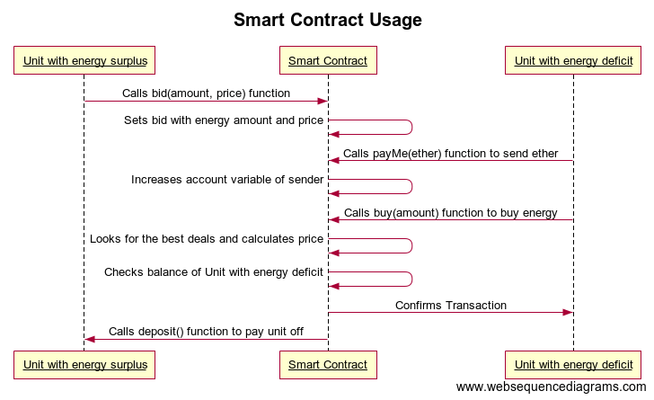

# 6. Structure of the Smart Contract

The Smart Contract is deployed via [Mist browser](https://github.com/ethereum/mist) to our private Ethereum blockchain. It represents a trading platform, which can be used by the five actors. They can perform the following activities:

* Charge their prepaid account with ether
* Offer energy for a specified ether price
* Buy a specific amount of energy for the offered ether price

Each of these activities is realized by a function of the Smart Contract. 

**For the realization of these functions, the Smart Contract has...**

* its own ether wallet to store the total prepaid balance of all actors. 
* five account variables to store the prepaid balance of each actor. The logic for the separation is implemented in the charging and buying function.
* five price variables to store the offers of each actor.

The solidity source code of the Smart Contract can be found [here](https://github.com/Ricardo-Cz/DEE_SCM/blob/master/EnergyBlockchain.1.sol).

## 

### 6.1 Sample Scenario

1. "Load" charges its prepaid account with 40 Ether.
2. "Chp" offers each kw for 3 Ether.
3. "Load" buys 10 kw from "Chp" for 30 Ether.

#### 6.1.1 **"Load" charges its prepaid account with 40 Ether.**

To charge the prepaid account, "Load" executes the PayMe function of the SmartContract with the chosen amount of Ether. The Ether will be transferred from the "Load" wallet to the Smart Contract wallet. The Smart Contract recognizes who sent the Ether and increases the corresponding account balance variable.

**Steps:**



















#### 6.1.2 "Chp" offers each kw for 3 Ether.

To publish an offer, "Chp" executes the bid function with the corresponding "Chp kw" value. The smart contract recognizes who executes the function. Therefore each actor can only change its own offers.

  
**Steps:**











#### 

#### 6.1.3 "Load" buys 10 kw from "Chp" for 30 Ether

"Load" looks which actor has the cheapest price per kw. Afterwards chooses how much kw should be bought from which actor and executes the "Energy Tokens" function. The Smart Contract will check, if "Load" has enough prepaid balance to perform this transaction. If so, the Smart Contract will send the corresponding amount of ether from its wallet to the wallet of all involved actors. The prepaid balance of "Load" will be reduced.

  
**Steps:**



















